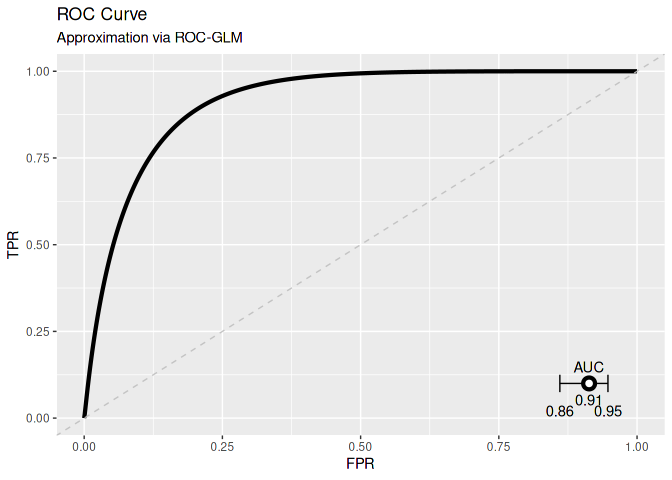

<!-- README.md is generated from README.Rmd. Please edit that file -->

[](https://github.com/difuture-lmu/dsROCGLM/actions)
[](https://www.gnu.org/licenses/lgpl-3.0)
[](https://codecov.io/gh/difuture-lmu/dsROCGLM)

# ROC-GLM for DataSHIELD

The package provides functionality to conduct and visualize ROC analysis
on decentralized data. The basis is the
DataSHIELD\](<https://www.datashield.org/>) infrastructure for
distributed computing. This package provides the calculation of the
[**ROC-GLM**](https://www.jstor.org/stable/2676973?seq=1) as well as
[**AUC confidence
intervals**](https://www.jstor.org/stable/2531595?seq=1). In order to
calculate the ROC-GLM it is necessry to push models and predict them at
the servers. This is done automatically by the base package
[`dsPredictBase`](https://github.com/difuture-lmu/dsPredictBase). Note
that DataSHIELD uses an option `datashield.privacyLevel` to indicate the
minimal amount of numbers required to be allowed to share an aggregated
value of these numbers. Instead of setting the option, we directly
retrieve the privacy level from the
[`DESCRIPTION`](https://github.com/difuture-lmu/dsROCGLM/blob/master/DESCRIPTION)
file each time a function calls for it. This options is set to 5 by
default.

## Installation

At the moment, there is no CRAN version available. Install the
development version from GitHub:

``` r
remotes::install_github("difuture-lmu/dsROCGLM")
```

#### Register methods

It is necessary to register the assign and aggregate methods in the OPAL
administration. These methods are registered automatically when
publishing the package on OPAL (see
[`DESCRIPTION`](https://github.com/difuture/dsROCGLM/blob/main/DESCRIPTION)).

Note that the package needs to be installed at both locations, the
server and the analysts machine.

## Usage

A more sophisticated example is available
[here](github.com/difuture-lmu/datashield-roc-glm-demo).

``` r
library(DSI)
#> Loading required package: progress
#> Loading required package: R6
library(DSOpal)
#> Loading required package: opalr
#> Loading required package: httr
library(dsBaseClient)

library(dsPredictBase)
library(dsROCGLM)
```

#### Log into DataSHIELD server

``` r
builder = newDSLoginBuilder()

surl     = "https://opal-demo.obiba.org/"
username = "administrator"
password = "password"

builder$append(
  server   = "ds1",
  url      = surl,
  user     = username,
  password = password
)
builder$append(
  server   = "ds2",
  url      = surl,
  user     = username,
  password = password
)

connections = datashield.login(logins = builder$build(), assign = TRUE)
#>
#> Logging into the collaborating servers
#>    [-------------------------------------------------------------------------------------]   0% / 0s  Login ds1 [========================>---------------------------------------------------]  33% / 0s  Login ds2 [==================================================>-------------------------]  67% / 0s  Logged in all servers [================================================================] 100% / 1s
```

#### Assign iris and validation vector at DataSHIELD (just for testing)

``` r
datashield.assign(connections, "iris", quote(iris))
#>    [-------------------------------------------------------------------------------------]   0% / 0s  Checking ds1 (iris <- iris) [----------------------------------------------------------]   0% / 1s  Finalizing assignment ds1 (iris <- iris) [==============>------------------------------]  33% / 1s  Checking ds2 (iris <- iris) [==================>---------------------------------------]  33% / 1s  Finalizing assignment ds2 (iris <- iris) [=============================>---------------]  67% / 1s  Assigned expr. (iris <- iris) [========================================================] 100% / 1s
datashield.assign(connections, "y", quote(c(rep(1, 50), rep(0, 100))))
#>    [-------------------------------------------------------------------------------------]   0% / 0s  Checking ds1 (y <- c(rep(1, 50), rep(0, 100))) [---------------------------------------]   0% / 0s  Finalizing assignment ds1 (y <- c(rep(1, 50), rep(0, 100))) [========>-----------------]  33% / 0s  Checking ds2 (y <- c(rep(1, 50), rep(0, 100))) [============>--------------------------]  33% / 0s  Finalizing assignment ds2 (y <- c(rep(1, 50), rep(0, 100))) [================>---------]  67% / 0s  Assigned expr. (y <- c(rep(1, 50), rep(0, 100))) [=====================================] 100% / 0s
```

#### Load test model, push to DataSHIELD, and calculate predictions

``` r
# Model predicts if species of iris is setosa or not.
iris$y = ifelse(iris$Species == "setosa", 1, 0)
mod = glm(y ~ Sepal.Length, data = iris, family = binomial())

# Push the model to the DataSHIELD servers using `dsPredictBase`:
pushObject(connections, mod)
#>    [-------------------------------------------------------------------------------------]   0% / 0s  Checking ds1 (mod <- decodeBinary("580a000000030004010200030500000000055554462d3800000313000000...  Finalizing assignment ds1 (mod <- decodeBinary("580a000000030004010200030500000000055554462d380...  Checking ds2 (mod <- decodeBinary("580a000000030004010200030500000000055554462d3800000313000000...  Finalizing assignment ds2 (mod <- decodeBinary("580a000000030004010200030500000000055554462d380...  Assigned expr. (mod <- decodeBinary("580a000000030004010200030500000000055554462d38000003130000...

# Calculate scores and save at the servers using `dsPredictBase`:
pfun =  "predict(mod, newdata = D, type = 'response')"
predictModel(connections, mod, "pred", "iris", predict_fun = pfun)
#>    [-------------------------------------------------------------------------------------]   0% / 0s  Checking ds1 (pred <- assignPredictModel("580a000000030004010200030500000000055554462d380000001...  Finalizing assignment ds1 (pred <- assignPredictModel("580a000000030004010200030500000000055554...  Checking ds2 (pred <- assignPredictModel("580a000000030004010200030500000000055554462d380000001...  Finalizing assignment ds2 (pred <- assignPredictModel("580a000000030004010200030500000000055554...  Assigned expr. (pred <- assignPredictModel("580a000000030004010200030500000000055554462d3800000...

datashield.symbols(connections)
#> $ds1
#> [1] "iris" "mod"  "pred" "y"
#>
#> $ds2
#> [1] "iris" "mod"  "pred" "y"
```

#### Calculate l2-sensitivity

``` r
# In order to securely calculate the ROC-GLM, we have to assess the
# l2-sensitivity to set the privacy parameters of differential
# privacy adequately:
l2s = dsL2Sens(connections, "iris", "pred")
#>    [-------------------------------------------------------------------------------------]   0% / 0s  Checking ds1 (dimDS("iris")) [---------------------------------------------------------]   0% / 0s  Getting aggregate ds1 (dimDS("iris")) [===============>--------------------------------]  33% / 0s  Checking ds2 (dimDS("iris")) [==================>--------------------------------------]  33% / 0s  Getting aggregate ds2 (dimDS("iris")) [===============================>----------------]  67% / 0s  Aggregated (dimDS("iris")) [===========================================================] 100% / 0s
#>    [-------------------------------------------------------------------------------------]   0% / 0s  Checking ds1 (xXcols <- decodeBinary("580a000000030004010200030500000000055554462d38000000fe", ...  Finalizing assignment ds1 (xXcols <- decodeBinary("580a000000030004010200030500000000055554462d...  Checking ds2 (xXcols <- decodeBinary("580a000000030004010200030500000000055554462d38000000fe", ...  Finalizing assignment ds2 (xXcols <- decodeBinary("580a000000030004010200030500000000055554462d...  Assigned expr. (xXcols <- decodeBinary("580a000000030004010200030500000000055554462d38000000fe"...
#>    [-------------------------------------------------------------------------------------]   0% / 0s  Checking ds1 (l2sens("iris", "pred", 100, "xXcols", diff, TRUE)) [---------------------]   0% / 0s  Getting aggregate ds1 (l2sens("iris", "pred", 100, "xXcols", diff, TRUE)) [===>--------]  33% / 0s  Checking ds2 (l2sens("iris", "pred", 100, "xXcols", diff, TRUE)) [======>--------------]  33% / 0s  Getting aggregate ds2 (l2sens("iris", "pred", 100, "xXcols", diff, TRUE)) [=======>----]  67% / 0s  Aggregated (...) [=====================================================================] 100% / 0s
#>    [-------------------------------------------------------------------------------------]   0% / 0s  Checking ds1 (rmDS("xXcols")) [--------------------------------------------------------]   0% / 0s  Getting aggregate ds1 (rmDS("xXcols")) [===============>-------------------------------]  33% / 0s  Checking ds2 (rmDS("xXcols")) [==================>-------------------------------------]  33% / 0s  Getting aggregate ds2 (rmDS("xXcols")) [==============================>----------------]  67% / 0s  Aggregated (rmDS("xXcols")) [==========================================================] 100% / 0s
l2s
#> [1] 0.1281

# Due to the results presented in https://arxiv.org/abs/2203.10828, we set the privacy parameters to
# - epsilon = 0.2, delta = 0.1 if i      l2s <= 0.01
# - epsilon = 0.3, delta = 0.4 if 0.01 < l2s <= 0.03
# - epsilon = 0.5, delta = 0.3 if 0.03 < l2s <= 0.05
# - epsilon = 0.5, delta = 0.5 if 0.05 < l2s <= 0.07
# - epsilon = 0.5, delta = 0.5 if 0.07 < l2s BUT results may be not good!
```

#### Calculate ROC-GLM

``` r
roc_glm = dsROCGLM(connections, truth_name = "y", pred_name = "pred",
  dat_name = "iris", seed_object = "y")
#>    [-------------------------------------------------------------------------------------]   0% / 0s  Checking ds1 (dimDS("iris")) [---------------------------------------------------------]   0% / 0s  Getting aggregate ds1 (dimDS("iris")) [===============>--------------------------------]  33% / 0s  Checking ds2 (dimDS("iris")) [==================>--------------------------------------]  33% / 0s  Getting aggregate ds2 (dimDS("iris")) [===============================>----------------]  67% / 0s  Aggregated (dimDS("iris")) [===========================================================] 100% / 0s
#>    [-------------------------------------------------------------------------------------]   0% / 0s  Checking ds1 (xXcols <- decodeBinary("580a000000030004010200030500000000055554462d38000000fe", ...  Finalizing assignment ds1 (xXcols <- decodeBinary("580a000000030004010200030500000000055554462d...  Checking ds2 (xXcols <- decodeBinary("580a000000030004010200030500000000055554462d38000000fe", ...  Finalizing assignment ds2 (xXcols <- decodeBinary("580a000000030004010200030500000000055554462d...  Assigned expr. (xXcols <- decodeBinary("580a000000030004010200030500000000055554462d38000000fe"...
#>    [-------------------------------------------------------------------------------------]   0% / 0s  Checking ds1 (l2sens("iris", "pred", 100, "xXcols", diff, TRUE)) [---------------------]   0% / 0s  Getting aggregate ds1 (l2sens("iris", "pred", 100, "xXcols", diff, TRUE)) [===>--------]  33% / 0s  Checking ds2 (l2sens("iris", "pred", 100, "xXcols", diff, TRUE)) [======>--------------]  33% / 0s  Getting aggregate ds2 (l2sens("iris", "pred", 100, "xXcols", diff, TRUE)) [=======>----]  67% / 0s  Aggregated (...) [=====================================================================] 100% / 0s
#>    [-------------------------------------------------------------------------------------]   0% / 0s  Checking ds1 (rmDS("xXcols")) [--------------------------------------------------------]   0% / 0s  Getting aggregate ds1 (rmDS("xXcols")) [===============>-------------------------------]  33% / 0s  Checking ds2 (rmDS("xXcols")) [==================>-------------------------------------]  33% / 0s  Getting aggregate ds2 (rmDS("xXcols")) [==============================>----------------]  67% / 0s  Aggregated (rmDS("xXcols")) [==========================================================] 100% / 0s
#>
#> [2022-03-23 14:15:55] L2 sensitivity is: 0.1281
#>
#>    [-------------------------------------------------------------------------------------]   0% / 0s  Checking ds1 (l2s <- decodeBinary("580a000000030004010200030500000000055554462d380000000e000000...  Finalizing assignment ds1 (l2s <- decodeBinary("580a000000030004010200030500000000055554462d380...  Checking ds2 (l2s <- decodeBinary("580a000000030004010200030500000000055554462d380000000e000000...  Finalizing assignment ds2 (l2s <- decodeBinary("580a000000030004010200030500000000055554462d380...  Assigned expr. (l2s <- decodeBinary("580a000000030004010200030500000000055554462d380000000e0000...
#> Warning in dsROCGLM(connections, truth_name = "y", pred_name = "pred", dat_name
#> = "iris", : l2-sensitivity may be too high for good results! Epsilon = 0.5 and
#> delta = 0.5 is used which may lead to bad results.
#>
#> [2022-03-23 14:15:56] Setting: epsilon = 0.5 and delta = 0.5
#>
#>
#> [2022-03-23 14:15:56] Initializing ROC-GLM
#>
#> [2022-03-23 14:15:56] Host: Received scores of negative response
#>
#> [2022-03-23 14:15:56] Receiving negative scores
#>    [-------------------------------------------------------------------------------------]   0% / 0s  Checking ds1 (getNegativeScores("y", "pred", 0.5, 0.5, "y", TRUE)) [-------------------]   0% / 0s  Getting aggregate ds1 (getNegativeScores("y", "pred", 0.5, 0.5, "y", TRUE)) [==>-------]  33% / 0s  Checking ds2 (getNegativeScores("y", "pred", 0.5, 0.5, "y", TRUE)) [=====>-------------]  33% / 0s  Getting aggregate ds2 (getNegativeScores("y", "pred", 0.5, 0.5, "y", TRUE)) [======>---]  67% / 0s  Aggregated (...) [=====================================================================] 100% / 0s
#> [2022-03-23 14:15:56] Host: Pushing pooled scores
#>    [-------------------------------------------------------------------------------------]   0% / 0s  Checking ds1 (pooled_scores <- decodeBinary("580a000000030004010200030500000000055554462d380000...  Finalizing assignment ds1 (pooled_scores <- decodeBinary("580a000000030004010200030500000000055...  Checking ds2 (pooled_scores <- decodeBinary("580a000000030004010200030500000000055554462d380000...  Finalizing assignment ds2 (pooled_scores <- decodeBinary("580a000000030004010200030500000000055...  Assigned expr. (pooled_scores <- decodeBinary("580a000000030004010200030500000000055554462d3800...
#> [2022-03-23 14:15:56] Server: Calculating placement values and parts for ROC-GLM
#>    [-------------------------------------------------------------------------------------]   0% / 0s  Checking ds1 (roc_data <- rocGLMFrame("y", "pred", "pooled_scores")) [-----------------]   0% / 0s  Finalizing assignment ds1 (roc_data <- rocGLMFrame("y", "pred", "pooled_scores")) [>---]  33% / 0s  Checking ds2 (roc_data <- rocGLMFrame("y", "pred", "pooled_scores")) [=====>-----------]  33% / 0s  Finalizing assignment ds2 (roc_data <- rocGLMFrame("y", "pred", "pooled_scores")) [==>-]  67% / 0s  Assigned expr. (roc_data <- rocGLMFrame("y", "pred", "pooled_scores")) [===============] 100% / 0s
#> [2022-03-23 14:15:57] Server: Calculating probit regression to obtain ROC-GLM
#>    [-------------------------------------------------------------------------------------]   0% / 0s  Checking ds1 (calculateDistrGLMParts(formula = y ~ x, data = "roc_data", w = "w", ) [--]   0% / 0s  Getting aggregate ds1 (calculateDistrGLMParts(formula = y ~ x, data = "roc_data", w = "w", ) []...  Checking ds2 (calculateDistrGLMParts(formula = y ~ x, data = "roc_data", w = "w", ) [>-]  33% / 0s  Getting aggregate ds2 (calculateDistrGLMParts(formula = y ~ x, data = "roc_data", w = "w", ) []...  Aggregated (calculateDistrGLMParts(formula = y ~ x, data = "roc_data", w = "w", ) [====] 100% / 0s
#> [2022-03-23 14:15:57] Deviance of iter1=137.2431
#>    [-------------------------------------------------------------------------------------]   0% / 0s  Checking ds1 (calculateDistrGLMParts(formula = y ~ x, data = "roc_data", w = "w", ) [--]   0% / 0s  Getting aggregate ds1 (calculateDistrGLMParts(formula = y ~ x, data = "roc_data", w = "w", ) []...  Checking ds2 (calculateDistrGLMParts(formula = y ~ x, data = "roc_data", w = "w", ) [>-]  33% / 0s  Getting aggregate ds2 (calculateDistrGLMParts(formula = y ~ x, data = "roc_data", w = "w", ) []...  Aggregated (calculateDistrGLMParts(formula = y ~ x, data = "roc_data", w = "w", ) [====] 100% / 0s
#> [2022-03-23 14:15:58] Deviance of iter2=121.5994
#>    [-------------------------------------------------------------------------------------]   0% / 0s  Checking ds1 (calculateDistrGLMParts(formula = y ~ x, data = "roc_data", w = "w", ) [--]   0% / 0s  Getting aggregate ds1 (calculateDistrGLMParts(formula = y ~ x, data = "roc_data", w = "w", ) []...  Checking ds2 (calculateDistrGLMParts(formula = y ~ x, data = "roc_data", w = "w", ) [>-]  33% / 0s  Getting aggregate ds2 (calculateDistrGLMParts(formula = y ~ x, data = "roc_data", w = "w", ) []...  Aggregated (calculateDistrGLMParts(formula = y ~ x, data = "roc_data", w = "w", ) [====] 100% / 0s
#> [2022-03-23 14:15:58] Deviance of iter3=147.7237
#>    [-------------------------------------------------------------------------------------]   0% / 0s  Checking ds1 (calculateDistrGLMParts(formula = y ~ x, data = "roc_data", w = "w", ) [--]   0% / 0s  Getting aggregate ds1 (calculateDistrGLMParts(formula = y ~ x, data = "roc_data", w = "w", ) []...  Checking ds2 (calculateDistrGLMParts(formula = y ~ x, data = "roc_data", w = "w", ) [>-]  33% / 0s  Getting aggregate ds2 (calculateDistrGLMParts(formula = y ~ x, data = "roc_data", w = "w", ) []...  Aggregated (calculateDistrGLMParts(formula = y ~ x, data = "roc_data", w = "w", ) [====] 100% / 0s
#> [2022-03-23 14:15:58] Deviance of iter4=140.4008
#>    [-------------------------------------------------------------------------------------]   0% / 0s  Checking ds1 (calculateDistrGLMParts(formula = y ~ x, data = "roc_data", w = "w", ) [--]   0% / 0s  Getting aggregate ds1 (calculateDistrGLMParts(formula = y ~ x, data = "roc_data", w = "w", ) []...  Checking ds2 (calculateDistrGLMParts(formula = y ~ x, data = "roc_data", w = "w", ) [>-]  33% / 0s  Getting aggregate ds2 (calculateDistrGLMParts(formula = y ~ x, data = "roc_data", w = "w", ) []...  Aggregated (calculateDistrGLMParts(formula = y ~ x, data = "roc_data", w = "w", ) [====] 100% / 1s
#> [2022-03-23 14:15:59] Deviance of iter5=129.2244
#>    [-------------------------------------------------------------------------------------]   0% / 0s  Checking ds1 (calculateDistrGLMParts(formula = y ~ x, data = "roc_data", w = "w", ) [--]   0% / 0s  Getting aggregate ds1 (calculateDistrGLMParts(formula = y ~ x, data = "roc_data", w = "w", ) []...  Checking ds2 (calculateDistrGLMParts(formula = y ~ x, data = "roc_data", w = "w", ) [>-]  33% / 0s  Getting aggregate ds2 (calculateDistrGLMParts(formula = y ~ x, data = "roc_data", w = "w", ) []...  Aggregated (calculateDistrGLMParts(formula = y ~ x, data = "roc_data", w = "w", ) [====] 100% / 0s
#> [2022-03-23 14:16:00] Deviance of iter6=123.9979
#>    [-------------------------------------------------------------------------------------]   0% / 0s  Checking ds1 (calculateDistrGLMParts(formula = y ~ x, data = "roc_data", w = "w", ) [--]   0% / 0s  Getting aggregate ds1 (calculateDistrGLMParts(formula = y ~ x, data = "roc_data", w = "w", ) []...  Checking ds2 (calculateDistrGLMParts(formula = y ~ x, data = "roc_data", w = "w", ) [>-]  33% / 0s  Getting aggregate ds2 (calculateDistrGLMParts(formula = y ~ x, data = "roc_data", w = "w", ) []...  Aggregated (calculateDistrGLMParts(formula = y ~ x, data = "roc_data", w = "w", ) [====] 100% / 0s
#> [2022-03-23 14:16:00] Deviance of iter7=123.1971
#>    [-------------------------------------------------------------------------------------]   0% / 0s  Checking ds1 (calculateDistrGLMParts(formula = y ~ x, data = "roc_data", w = "w", ) [--]   0% / 0s  Getting aggregate ds1 (calculateDistrGLMParts(formula = y ~ x, data = "roc_data", w = "w", ) []...  Checking ds2 (calculateDistrGLMParts(formula = y ~ x, data = "roc_data", w = "w", ) [>-]  33% / 0s  Getting aggregate ds2 (calculateDistrGLMParts(formula = y ~ x, data = "roc_data", w = "w", ) []...  Aggregated (calculateDistrGLMParts(formula = y ~ x, data = "roc_data", w = "w", ) [====] 100% / 0s
#> [2022-03-23 14:16:00] Deviance of iter8=124.1615
#>    [-------------------------------------------------------------------------------------]   0% / 0s  Checking ds1 (calculateDistrGLMParts(formula = y ~ x, data = "roc_data", w = "w", ) [--]   0% / 0s  Getting aggregate ds1 (calculateDistrGLMParts(formula = y ~ x, data = "roc_data", w = "w", ) []...  Checking ds2 (calculateDistrGLMParts(formula = y ~ x, data = "roc_data", w = "w", ) [>-]  33% / 0s  Getting aggregate ds2 (calculateDistrGLMParts(formula = y ~ x, data = "roc_data", w = "w", ) []...  Aggregated (calculateDistrGLMParts(formula = y ~ x, data = "roc_data", w = "w", ) [====] 100% / 0s
#> [2022-03-23 14:16:01] Deviance of iter9=124.5356
#>    [-------------------------------------------------------------------------------------]   0% / 0s  Checking ds1 (calculateDistrGLMParts(formula = y ~ x, data = "roc_data", w = "w", ) [--]   0% / 0s  Getting aggregate ds1 (calculateDistrGLMParts(formula = y ~ x, data = "roc_data", w = "w", ) []...  Checking ds2 (calculateDistrGLMParts(formula = y ~ x, data = "roc_data", w = "w", ) [>-]  33% / 0s  Getting aggregate ds2 (calculateDistrGLMParts(formula = y ~ x, data = "roc_data", w = "w", ) []...  Aggregated (calculateDistrGLMParts(formula = y ~ x, data = "roc_data", w = "w", ) [====] 100% / 0s
#> [2022-03-23 14:16:01] Deviance of iter10=124.5503
#>    [-------------------------------------------------------------------------------------]   0% / 0s  Checking ds1 (calculateDistrGLMParts(formula = y ~ x, data = "roc_data", w = "w", ) [--]   0% / 0s  Getting aggregate ds1 (calculateDistrGLMParts(formula = y ~ x, data = "roc_data", w = "w", ) []...  Checking ds2 (calculateDistrGLMParts(formula = y ~ x, data = "roc_data", w = "w", ) [>-]  33% / 0s  Getting aggregate ds2 (calculateDistrGLMParts(formula = y ~ x, data = "roc_data", w = "w", ) []...  Aggregated (calculateDistrGLMParts(formula = y ~ x, data = "roc_data", w = "w", ) [====] 100% / 0s
#> [2022-03-23 14:16:02] Deviance of iter11=124.5504
#>    [-------------------------------------------------------------------------------------]   0% / 0s  Checking ds1 (calculateDistrGLMParts(formula = y ~ x, data = "roc_data", w = "w", ) [--]   0% / 0s  Getting aggregate ds1 (calculateDistrGLMParts(formula = y ~ x, data = "roc_data", w = "w", ) []...  Checking ds2 (calculateDistrGLMParts(formula = y ~ x, data = "roc_data", w = "w", ) [>-]  33% / 0s  Getting aggregate ds2 (calculateDistrGLMParts(formula = y ~ x, data = "roc_data", w = "w", ) []...  Aggregated (calculateDistrGLMParts(formula = y ~ x, data = "roc_data", w = "w", ) [====] 100% / 0s
#> [2022-03-23 14:16:02] Deviance of iter12=124.5504
#> [2022-03-23 14:16:02] Host: Finished calculating ROC-GLM
#> [2022-03-23 14:16:02] Host: Cleaning data on server
#> [2022-03-23 14:16:03] Host: Calculating AUC and CI
#>    [-------------------------------------------------------------------------------------]   0% / 0s  Checking ds1 (meanDS(y)) [-------------------------------------------------------------]   0% / 0s  Getting aggregate ds1 (meanDS(y)) [================>-----------------------------------]  33% / 0s  Checking ds2 (meanDS(y)) [===================>-----------------------------------------]  33% / 0s  Getting aggregate ds2 (meanDS(y)) [==================================>-----------------]  67% / 0s  Aggregated (meanDS(y)) [===============================================================] 100% / 0s
#>    [-------------------------------------------------------------------------------------]   0% / 0s  Checking ds1 (getNegativeScoresVar("y", "pred", return_sum = TRUE)) [------------------]   0% / 0s  Getting aggregate ds1 (getNegativeScoresVar("y", "pred", return_sum = TRUE)) [==>------]  33% / 0s  Checking ds2 (getNegativeScoresVar("y", "pred", return_sum = TRUE)) [=====>------------]  33% / 0s  Getting aggregate ds2 (getNegativeScoresVar("y", "pred", return_sum = TRUE)) [=====>---]  67% / 0s  Aggregated (...) [=====================================================================] 100% / 0s
#>    [-------------------------------------------------------------------------------------]   0% / 0s  Checking ds1 (getPositiveScoresVar("y", "pred", return_sum = TRUE)) [------------------]   0% / 0s  Getting aggregate ds1 (getPositiveScoresVar("y", "pred", return_sum = TRUE)) [==>------]  33% / 0s  Checking ds2 (getPositiveScoresVar("y", "pred", return_sum = TRUE)) [=====>------------]  33% / 0s  Getting aggregate ds2 (getPositiveScoresVar("y", "pred", return_sum = TRUE)) [=====>---]  67% / 0s  Aggregated (...) [=====================================================================] 100% / 0s
#>    [-------------------------------------------------------------------------------------]   0% / 0s  Checking ds1 (getNegativeScoresVar("y", "pred", m = 1)) [------------------------------]   0% / 0s  Getting aggregate ds1 (getNegativeScoresVar("y", "pred", m = 1)) [======>--------------]  33% / 0s  Checking ds2 (getNegativeScoresVar("y", "pred", m = 1)) [=========>--------------------]  33% / 0s  Getting aggregate ds2 (getNegativeScoresVar("y", "pred", m = 1)) [=============>-------]  67% / 0s  Aggregated (...) [=====================================================================] 100% / 0s
#>    [-------------------------------------------------------------------------------------]   0% / 0s  Checking ds1 (getPositiveScoresVar("y", "pred", m = 1)) [------------------------------]   0% / 0s  Getting aggregate ds1 (getPositiveScoresVar("y", "pred", m = 1)) [======>--------------]  33% / 0s  Checking ds2 (getPositiveScoresVar("y", "pred", m = 1)) [=========>--------------------]  33% / 0s  Getting aggregate ds2 (getPositiveScoresVar("y", "pred", m = 1)) [=============>-------]  67% / 0s  Aggregated (...) [=====================================================================] 100% / 0s
#>    [-------------------------------------------------------------------------------------]   0% / 0s  Checking ds1 (getNegativeScores("y", "pred", 0.5, 0.5, "y", TRUE)) [-------------------]   0% / 0s  Getting aggregate ds1 (getNegativeScores("y", "pred", 0.5, 0.5, "y", TRUE)) [==>-------]  33% / 0s  Checking ds2 (getNegativeScores("y", "pred", 0.5, 0.5, "y", TRUE)) [=====>-------------]  33% / 0s  Getting aggregate ds2 (getNegativeScores("y", "pred", 0.5, 0.5, "y", TRUE)) [======>---]  67% / 0s  Aggregated (...) [=====================================================================] 100% / 0s
#>    [-------------------------------------------------------------------------------------]   0% / 0s  Checking ds1 (getPositiveScores("y", "pred", 0.5, 0.5, "y", TRUE)) [-------------------]   0% / 0s  Getting aggregate ds1 (getPositiveScores("y", "pred", 0.5, 0.5, "y", TRUE)) [==>-------]  33% / 0s  Checking ds2 (getPositiveScores("y", "pred", 0.5, 0.5, "y", TRUE)) [=====>-------------]  33% / 0s  Getting aggregate ds2 (getPositiveScores("y", "pred", 0.5, 0.5, "y", TRUE)) [======>---]  67% / 0s  Aggregated (...) [=====================================================================] 100% / 0s
#> [2022-03-23 14:16:05] Finished!
roc_glm
#>
#> ROC-GLM after Pepe:
#>
#>  Binormal form: pnorm(2.51 + 1.55*qnorm(t))
#>
#>  AUC and 0.95 CI: [0.86----0.91----0.95]

plot(roc_glm)
```

<!-- -->

## Deploy information:

**Build by daniel (Linux) on 2022-03-23 14:16:06.**

This readme is built automatically after each push to the repository.
Hence, it also is a test if the functionality of the package works also
on the DataSHIELD servers. We also test these functionality in
`tests/testthat/test_on_active_server.R`. The system information of the
local and remote servers are as followed:

  - Local machine:
      - `R` version: R version 4.1.2 (2021-11-01)
      - Version of DataSHELD client packages:

| Package       | Version |
| :------------ | :------ |
| DSI           | 1.3.0   |
| DSOpal        | 1.3.1   |
| dsBaseClient  | 6.1.1   |
| dsPredictBase | 0.0.1   |
| dsROCGLM      | 0.0.1   |

  - Remote DataSHIELD machines:
      - `R` version of ds1: R version 4.1.1 (2021-08-10)
      - `R` version of ds2: R version 4.1.1 (2021-08-10)
      - Version of server packages:

| Package       | ds1: Version | ds2: Version |
| :------------ | :----------- | :----------- |
| dsBase        | 6.1.1        | 6.1.1        |
| resourcer     | 1.1.1        | 1.1.1        |
| dsPredictBase | 0.0.1        | 0.0.1        |
| dsROCGLM      | 0.0.1        | 0.0.1        |
