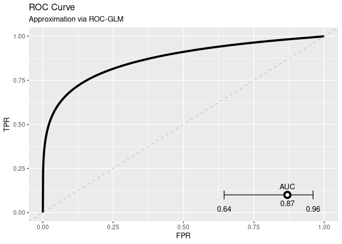

<!-- README.md is generated from README.Rmd. Please edit that file -->

    ## Loading ds.roc.glm

    ## Loading ds.predict.base

# ROC-GLM for DataSHIELD

## Overview

## Installation

#### Developer version:

The package is currently hosted at a private GitLab repository. If
access is granted, the installation can be done via `devtools`:

``` r
cred = git2r::cred_user_pass(username = "username", password = "password")
devtools::install_git("https://gitlab.lrz.de/difuture_analysegruppe/ds.roc.glm.git", credentials = cred)
```

Note that you have to supply your username and password from GitLab to
install the package.

#### Register methods

It is necessary to register the assign and aggregate methods in the OPAL
administration to use them.

**Assign methods:**

  - `ds.roc.glm::rocGLMFrame`

**Aggregate methods:**

  - `ds.roc.glm::getPositiveScores`
  - `ds.roc.glm::getNegativeScores`
  - `ds.roc.glm::calculateDistrGLMParts`

## Usage

The following code shows how to use the ROC-GLM.

``` r
library(DSI)
#> Loading required package: progress
#> Loading required package: R6
library(DSOpal)
#> Loading required package: opalr
#> Loading required package: httr
library(DSLite)
library(dsBaseClient)


## DataSHIELD login:
## ========================================

builder = DSI::newDSLoginBuilder()

builder$append(
  server   = "ibe",
  url      = "https://dsibe.ibe.med.uni-muenchen.de",
  user     = "ibe",
  password = "123456",
  table    = "ProVal.KUM"
)

logindata = builder$build()
connections = DSI::datashield.login(logins = logindata, assign = TRUE, symbol = "D", opts = list(ssl_verifyhost = 0, ssl_verifypeer=0))
#> 
#> Logging into the collaborating servers
#>   Logged in all servers [================================================================] 100% / 1s
#> 
#>   No variables have been specified. 
#>   All the variables in the table 
#>   (the whole dataset) will be assigned to R!
#> 
#> Assigning table data...
#>   Assigned all tables [==================================================================] 100% / 2s

### Get available tables:
DSI::datashield.symbols(connections)
#> $ibe
#> [1] "D"


## Read test data (same as on server)
## ========================================

# We use this data to calculate a model which we want to evaluate. Here a simple logistic regression:
dat = read.csv("data/test-kum.csv")
mod = glm(gender ~ age + height, family = "binomial", data = dat)


## Preperation for ROC-GLM
## ========================================

### The ROC-GLM requires scores and true values. The function `predictModel` calculates the
### scores based on a model. In our case the logistic regression form above.

### Upload model to DataSHIELD server:
pushModel(connections, mod)
#>   Assigned expr. (mod <- decodeModel("58-0a-00-00-00-03-00-04-00-00-00-03-05-00-00-00-00-05-55-54...

### Predict uploaded model on server data. Scores are stored in an object called `pred`:
predictModel(connections, mod, "pred", "D", predict_fun = "predict(mod, newdata = D, type = 'response')")
#>   Assigned expr. (pred <- assignPredictModel("58-0a-00-00-00-03-00-04-00-00-00-03-05-00-00-00-00-...

### The `pred` object is later used for the ROC-GLM.

### Get object on server:
DSI::datashield.symbols(connections)
#> $ibe
#> [1] "D"    "mod"  "pred"


## Calculate and visualize ROC-GLM
## ========================================

### Now, calculate ROC-GLM:
roc_glm = dsROCGLM(connections, "D$gender", "pred")
#> 
#> Initializing ROC-GLM
#> 
#> > Host: Received scores of negative response
#>   Aggregated (getNegativeScores("D$gender", "pred")) [===================================] 100% / 0s
#> > Host: Pushing pooled scores
#>   Assigned expr. (pooled_scores <- decodeModel("58-0a-00-00-00-03-00-04-00-00-00-03-05-00-00-00-0...
#> > Server: Calculating placement values and parts for ROC-GLM
#>   Assigned expr. (roc_data <- rocGLMFrame("D$gender", "pred", "pooled_scores")) [========] 100% / 0s
#> > Server: Calculating probit regression to obtain ROC-GLM
#>   Aggregated (calculateDistrGLMParts(formula = y ~ x, data = "roc_data", w = "w", ) [====] 100% / 0s
#> Deviance of iter 1 = 49.91
#>   Aggregated (calculateDistrGLMParts(formula = y ~ x, data = "roc_data", w = "w", ) [====] 100% / 0s
#> Deviance of iter 2 = 62.88
#>   Aggregated (calculateDistrGLMParts(formula = y ~ x, data = "roc_data", w = "w", ) [====] 100% / 0s
#> Deviance of iter 3 = 76.06
#>   Aggregated (calculateDistrGLMParts(formula = y ~ x, data = "roc_data", w = "w", ) [====] 100% / 0s
#> Deviance of iter 4 = 82.09
#>   Aggregated (calculateDistrGLMParts(formula = y ~ x, data = "roc_data", w = "w", ) [====] 100% / 0s
#> Deviance of iter 5 = 83.48
#>   Aggregated (calculateDistrGLMParts(formula = y ~ x, data = "roc_data", w = "w", ) [====] 100% / 0s
#> Deviance of iter 6 = 83.53
#>   Aggregated (calculateDistrGLMParts(formula = y ~ x, data = "roc_data", w = "w", ) [====] 100% / 0s
#> Deviance of iter 7 = 83.53
#>   Aggregated (calculateDistrGLMParts(formula = y ~ x, data = "roc_data", w = "w", ) [====] 100% / 0s
#> Deviance of iter 8 = 83.53 
#> 
#> > Host: Finished calculating ROC-GLM
#> > Host: Cleaning data on server
#> > Host: Calculating AUC and CI
#>   Aggregated (getNegativeScores("D$gender", "pred")) [===================================] 100% / 0s
#>   Aggregated (getPositiveScores("D$gender", "pred")) [===================================] 100% / 0s
#> Finished!
roc_glm
#> 
#> ROC-GLM after Pepe:
#> 
#>  Binormal form: pnorm(1.35 + 0.67*qnorm(t))
#> 
#>  AUC and 0.95 CI: [0.64----0.87----0.96]

### And plot it:
plot(roc_glm)
```

<!-- -->

``` r


## Logout from DataSHIELD server
## ========================================

DSI::datashield.logout(conns = connections, save = FALSE)
#>   Logged out from all servers [==========================================================] 100% / 0s
```
